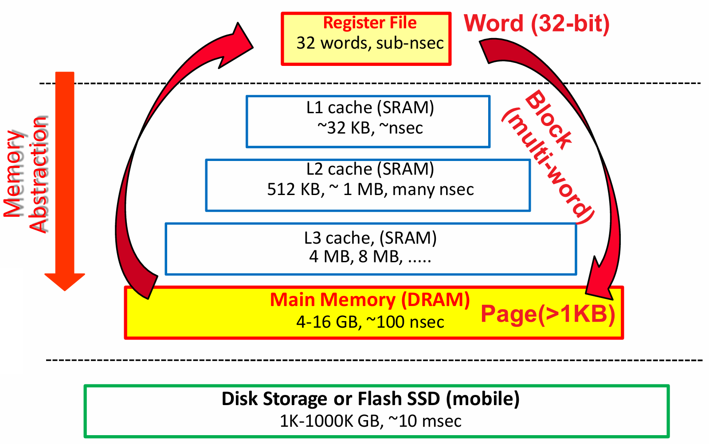
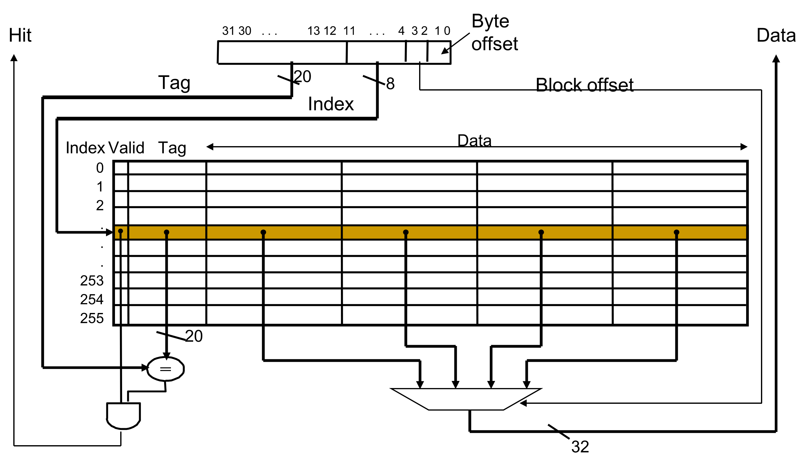
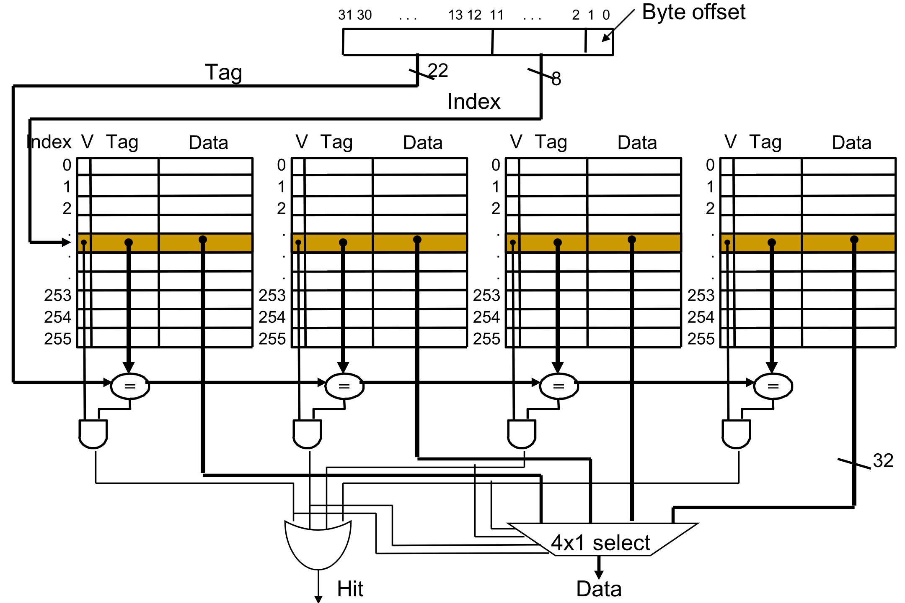
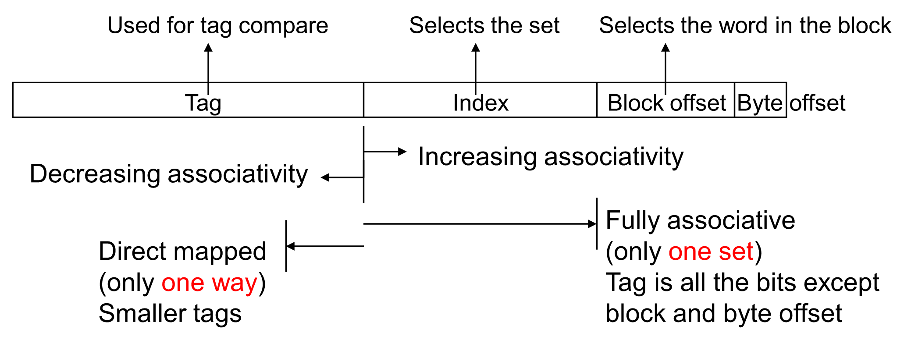
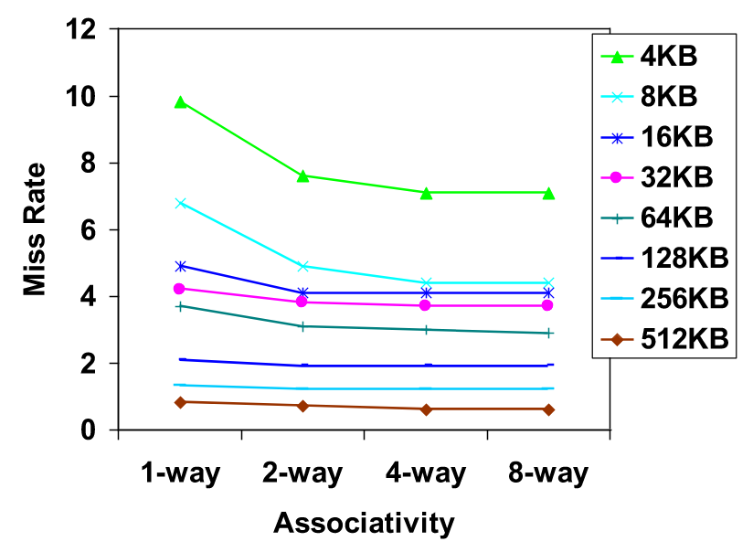
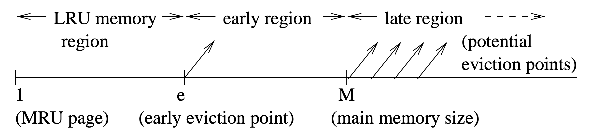
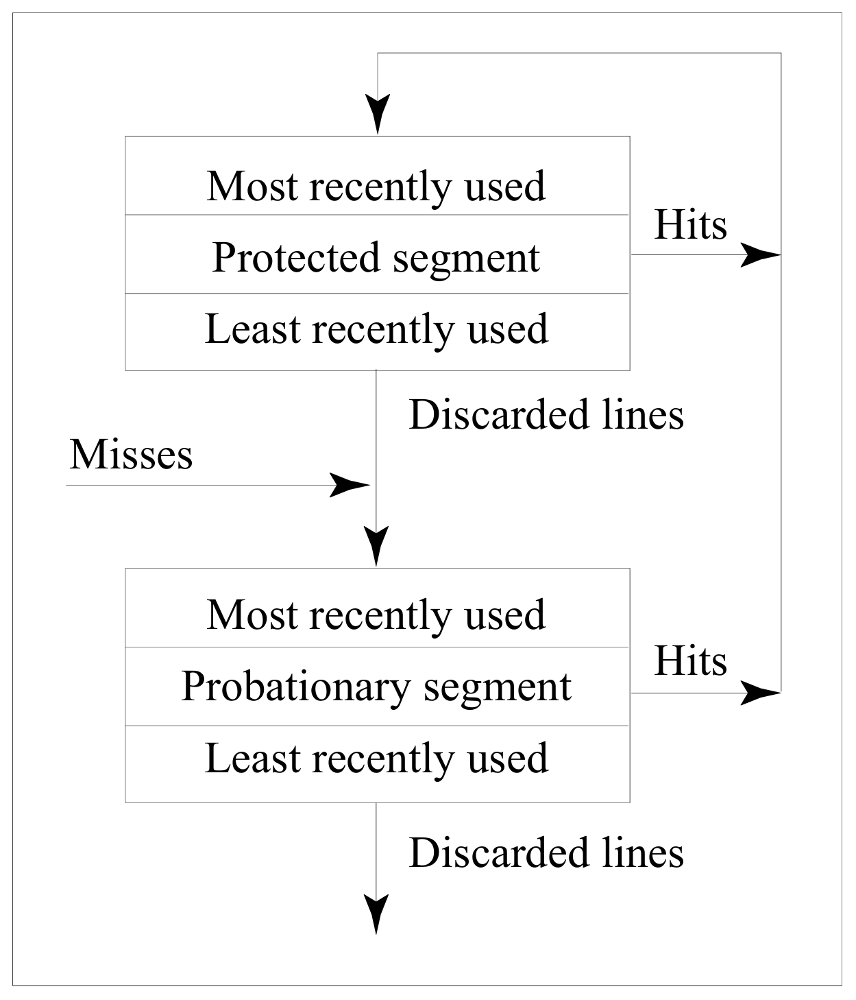
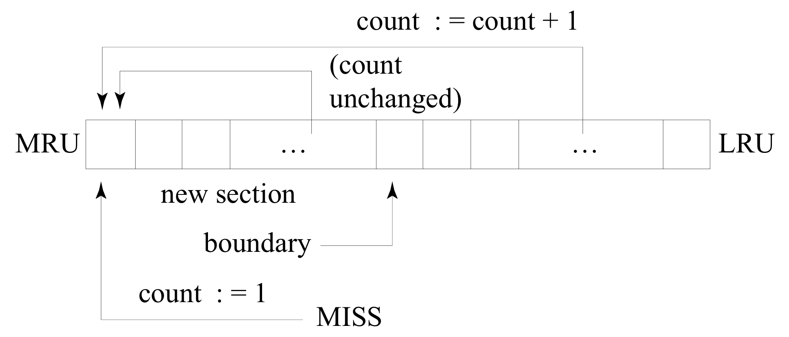
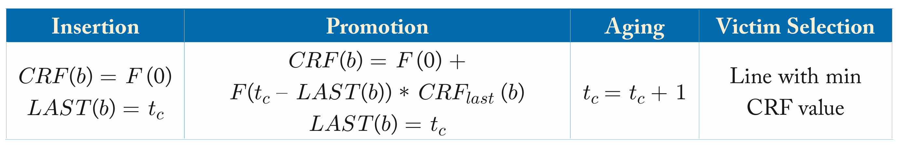

# 三、内存系统

## 3.1 内存层次结构

<figure>
  
  <figcaption>Memory Hierarchy</figcaption>
</figure>

寄存器和缓存之间的数据粒度为 Word（32-bit），缓存之间的数据粒度为 Block（multi-word），缓存和主存之间的数据粒度为 Page（>1KB）。

## 3.2 缓存

### 分类

*直接映射 Direct-Mapped*

<figure>
  
  <figcaption>Direct-Mapped Cache</figcaption>
</figure>

内存中的数据只会被映射到缓存中的一个位置。

*组相联映射 Set-Associative*

<figure>
  
  <figcaption>Set-Assocoative Cache</figcaption>
</figure>

内存中的数据会被映射到缓存中的多个位置，每个位置称为一路（Way）。

<figure>
  
  <figcaption>Range of Set Associative Caches</figcaption>
</figure>

对于固定大小的缓存，关联性每增加两倍，每组的块数（即路数）就会加倍，并将组数（set）减半——组索引的大小减少 1 位并增加标签的 1 位。

<figure>
  
  <figcaption>Benefits of Set Associative Caches</figcaption>
</figure>

最大的收益是从直接映射变为 2 路（miss rate 降低 20% 以上）。
增加关联性的收益递减，4 路和 8 路的性能差别不大。

需要注意的是，访问标签（tag）存储器和数据存储器的步骤可以顺序执行，也可以并行执行。
**顺序访问**的好处是，在确定对某路的缓存命中后，缓存仅访问发生命中的数据存储单元的一路，更加**节约功耗**。
另一种方法是**并行访问**标签存储器和数据存储器，这种方法**更快**，因为在确定命中或未命中时，所有路的缓存行都已被读取，剩下的就是从读取的缓存行中选择匹配的和对应的字节。
这种设计方法的功耗相对之下就更高。

### 替换策略

当需要访问的内存块不在缓存中时，访问会触发**缓存未命中**，并需要在缓存中**选择剔除块**去进行替换。
在组相联的缓存中，可能有**多个缓存行**是替换的候选对象。
理论上，最优替换策略是替换**距离即将访问到的位置最远的块**，但现实中**无法实现**，因为这需要来自未来的信息。

实际中可行的替换策略是尝试**最小化未命中率**的方式选择剔除块。
大多数研究都集中在更智能的**粗粒度替换策略**的开发上，每个缓存行都与少量的**替换状态**相关联，这些替换状态为所有新插入的缓存行进行统一初始化，然后再重复使用**简单的规则**进行缓存行插入操作。

*LRU (Least Recently Used)*

在选择被替换的缓存行时，LRU 策略简单地剔除一组给定候选缓存行中**最旧的行**。
为了找到最旧的行，LRU 策略在概念上维护了一个**新近栈**，其中栈顶端表示最近使用（Most Recently Used）行，栈底部表示最近最少使用（LRU）行。
通过将每一行与**一个计数器相关联**并对它进行更新来维护这个栈。

*MRU (Most Recently Used)*

通过剔除新的缓存行以保留旧的缓存行来解决缓存“颠簸”的问题。
当应用程序的**工作集大于缓存容量**时，它能够**保留**工作集的一部分。

*[EELRU (Early Eviction LRU)](https://yanniss.github.io/eelrufinal2.pdf)*

当工作集**适合**缓存时，EELRU 策略会剔除 **LRU 缓存行**，但当观察到以**大于主内存的循环模式**访问缓存行过多时，会剔除**第 e 条最近使用的缓存行**。

<figure>
  
  <figcaption>General EELRU Scheme</figcaption>
</figure>

EELRU 策略会跟踪每个区域的缓存命中数。
如果分布是**单调递减**，则 EELRU 假定没有缓存“颠簸”并**剔除晚期区域**的缓存行；如果分布显示**晚期区域的命中次数多于早期区域**，则 EELRU 策略会**从早期区域**剔除缓存行，这允许来自晚期区域的缓存行在缓存中保留更长的时间。

*Seg-LRU (Segmented LRU)*

通过**优先保留至少被访问过两次**的缓存行来处理扫描访问。
Seg-LRU 将 LRU 栈分为两个逻辑段：**试用段（Probationary Segment）**和**保护段（Protected Segment）**。

<figure>
  
  <figcaption>Seg-LRU Replacement Policy</figcaption>
</figure>

新写入的缓存行被插入到试用段中的 MRU 位置，并且在缓存命中时，缓存行被移动到保护段中的 MRU 位置。
由于保护段是有限的，因此对保护段的写入可能会迫使**保护段中的 LRU 缓存行迁移到试用段的 MRU端**，从而使这条缓存行从试用段被剔除前有机会**再次被命中**。
因为旧的缓存行最终会迁移到试用段，Seg-LRU 策略可以适应程序工作集的变化。

*LFU (Least Frequently Used)*

该策略将频率计数器与每个缓存行相关联。
当新的行插入缓存时，频率计数器被初始化为 0，并且每次访问该行时都会递增。
在缓存发生未命中时，具有最低访问频率的缓存行会被剔除。

*FBR (Frequency-Based Replacement)*

由于短暂的**时间局部性**可能产生“虚假”的高频率计数器值，从而误导基于单纯的频率统计的策略。
因此，FBR 通过**选择性**地增加频率计数器来降低时间局部性的影响。
由于 FBR 不会增加 LRU 栈的**顶部**的频率计数器，因此短暂的时间局部性不会影响频率计数器。

<figure>
  
  <figcaption>Frequency-Based Replacement</figcaption>
</figure>

FBR 的缺点是一旦缓存行从新段老化，即使是经常使用的行也会很快被剔除，因为它们**没有足够的时间**来增加频率计数。

*LRFU (Least Recently/Frequently Used)*

LRFU 替换策略使用被称为新近和频率组合（Combined Recency and Frequency，CRF）的新指标，通过加权函数衡量每次访问的相对贡献。
LRFU 为每个块计算一个 CRF 值，它是每个过往参考的权重函数 $F(x)$ 的总和，其中 $x$ 是过去访问与当前时间的距离。

$$
F\left(x\right)=\left(\frac1p\right)^{\large\lambda x}
$$

<figure>
  
  <figcaption>LRFU Replacement Policy</figcaption>
</figure>