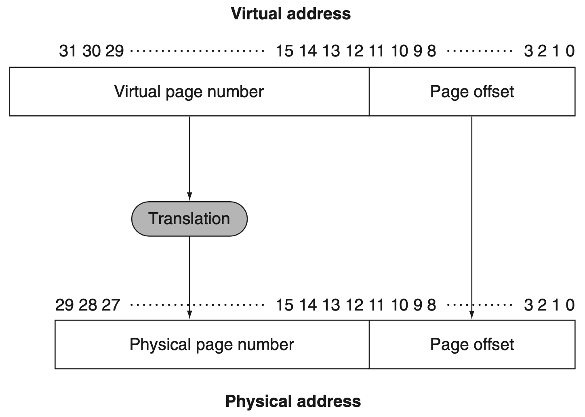
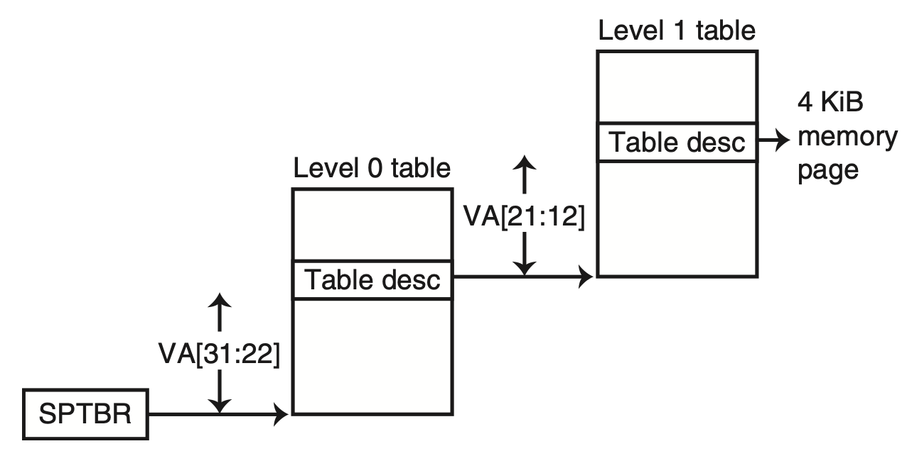
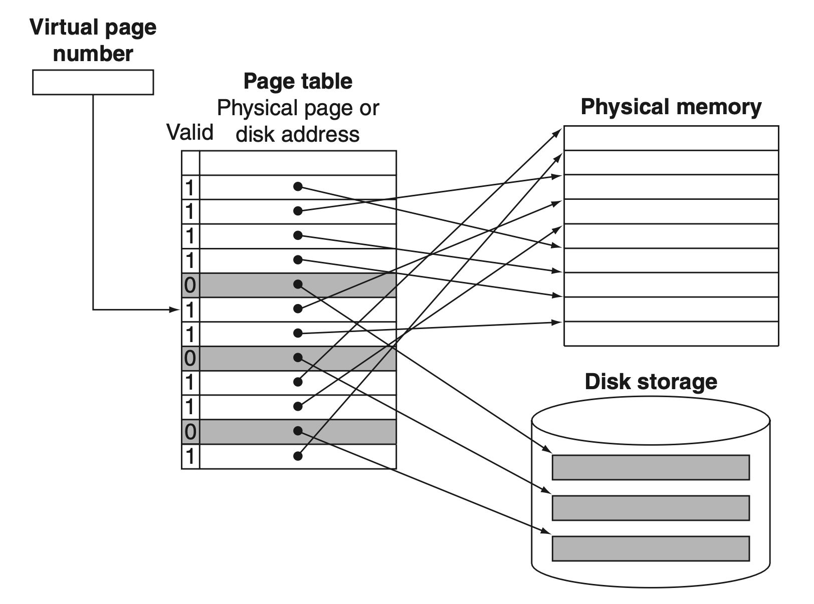
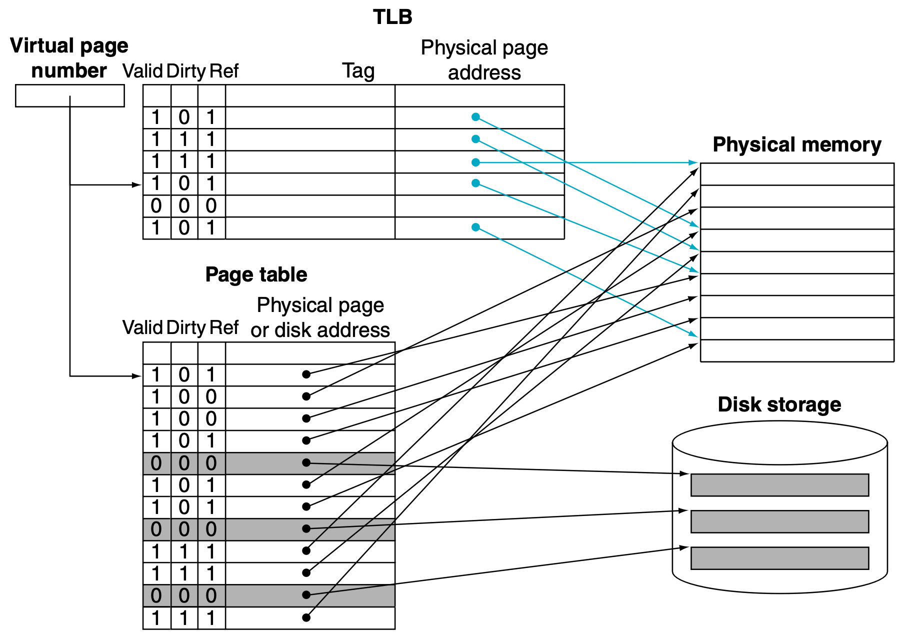
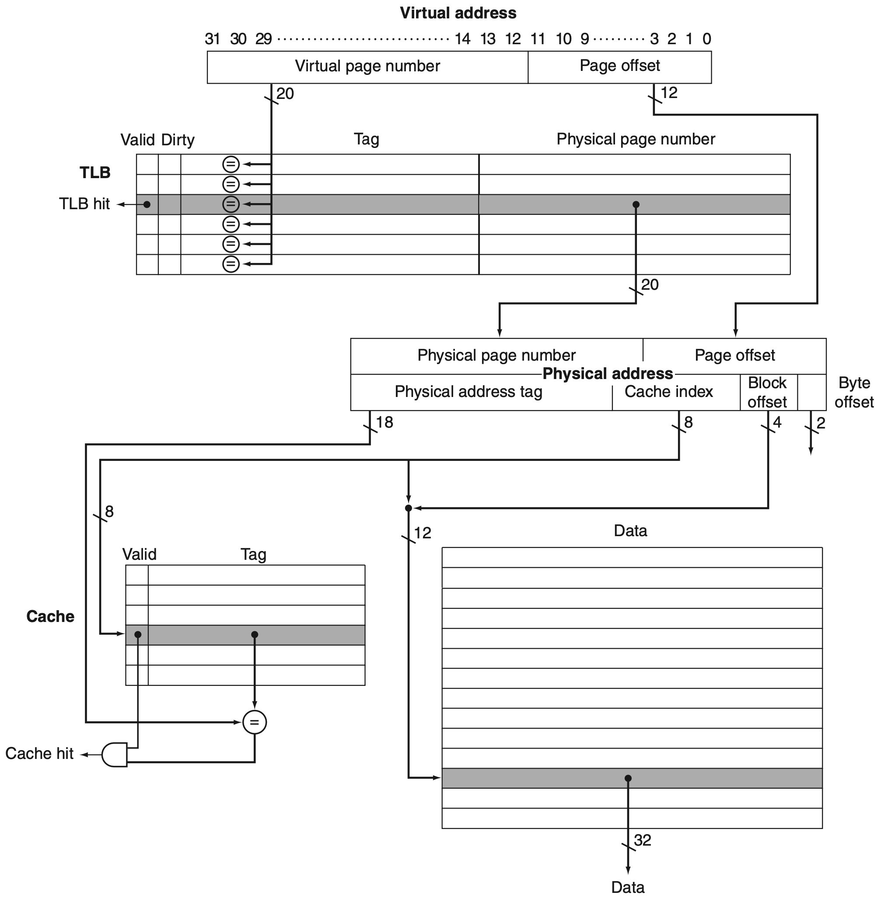
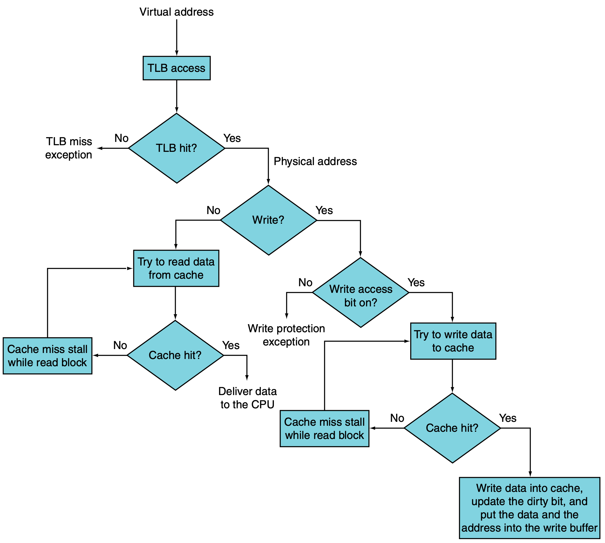

# 三、内存系统

## 3.1 内存层次结构

<figure>
  
  <figcaption>Memory Hierarchy</figcaption>
</figure>

寄存器和缓存之间的数据粒度为 Word（32-bit），缓存之间的数据粒度为 Block（multi-word），缓存和主存之间的数据粒度为 Page（>1KB）。

## 3.2 缓存

### 分类

*直接映射 Direct-Mapped*

<figure>
  
  <figcaption>Direct-Mapped Cache</figcaption>
</figure>

内存中的数据只会被映射到缓存中的一个位置。

*组相联映射 Set-Associative*

<figure>
  
  <figcaption>Set-Assocoative Cache</figcaption>
</figure>

内存中的数据会被映射到缓存中的多个位置，每个位置称为一路（Way）。

<figure>
  
  <figcaption>Range of Set Associative Caches</figcaption>
</figure>

对于固定大小的缓存，关联性每增加两倍，每组的块数（即路数）就会加倍，并将组数（set）减半——组索引的大小减少 1 位并增加标签的 1 位。

<figure>
  
  <figcaption>Benefits of Set Associative Caches</figcaption>
</figure>

最大的收益是从直接映射变为 2 路（miss rate 降低 20% 以上）。
增加关联性的收益递减，4 路和 8 路的性能差别不大。

需要注意的是，访问标签（tag）存储器和数据存储器的步骤可以顺序执行，也可以并行执行。
**顺序访问**的好处是，在确定对某路的缓存命中后，缓存仅访问发生命中的数据存储单元的一路，更加**节约功耗**。
另一种方法是**并行访问**标签存储器和数据存储器，这种方法**更快**，因为在确定命中或未命中时，所有路的缓存行都已被读取，剩下的就是从读取的缓存行中选择匹配的和对应的字节。
这种设计方法的功耗相对之下就更高。

### 替换策略

当需要访问的内存块不在缓存中时，访问会触发**缓存未命中**，并需要在缓存中**选择剔除块**去进行替换。
在组相联的缓存中，可能有**多个缓存行**是替换的候选对象。
理论上，最优替换策略是替换**距离即将访问到的位置最远的块**，但现实中**无法实现**，因为这需要来自未来的信息。

实际中可行的替换策略是尝试**最小化未命中率**的方式选择剔除块。
大多数研究都集中在更智能的**粗粒度替换策略**的开发上，每个缓存行都与少量的**替换状态**相关联，这些替换状态为所有新插入的缓存行进行统一初始化，然后再重复使用**简单的规则**进行缓存行插入操作。

*LRU (Least Recently Used)*

在选择被替换的缓存行时，LRU 策略简单地剔除一组给定候选缓存行中**最旧的行**。
为了找到最旧的行，LRU 策略在概念上维护了一个**新近栈**，其中栈顶端表示最近使用（Most Recently Used）行，栈底部表示最近最少使用（LRU）行。
通过将每一行与**一个计数器相关联**并对它进行更新来维护这个栈。
实现真正的 LRU 策略开销很大，一般会给每个缓存行添加 **引用位（reference bit）**，每次访问时将 reference bit 置为 1，然后周期性地将所有 reference bit 置零，用于表示一段时间内的访问情况。

*MRU (Most Recently Used)*

通过剔除新的缓存行以保留旧的缓存行来解决缓存“颠簸”的问题。
当应用程序的**工作集大于缓存容量**时，它能够**保留**工作集的一部分。

*EELRU (Early Eviction LRU)*

当工作集**适合**缓存时，EELRU 策略会剔除 **LRU 缓存行**，但当观察到以**大于主内存的循环模式**访问缓存行过多时，会剔除**第 e 条最近使用的缓存行**。

<figure>
  
  <figcaption>General EELRU Scheme</figcaption>
</figure>

EELRU 策略会跟踪每个区域的缓存命中数。
如果分布是**单调递减**，则 EELRU 假定没有缓存“颠簸”并**剔除晚期区域**的缓存行；如果分布显示**晚期区域的命中次数多于早期区域**，则 EELRU 策略会**从早期区域**剔除缓存行，这允许来自晚期区域的缓存行在缓存中保留更长的时间。

*Seg-LRU (Segmented LRU)*

通过**优先保留至少被访问过两次**的缓存行来处理扫描访问。
Seg-LRU 将 LRU 栈分为两个逻辑段：**试用段（Probationary Segment）**和**保护段（Protected Segment）**。

<figure>
  
  <figcaption>Seg-LRU Replacement Policy</figcaption>
</figure>

新写入的缓存行被插入到试用段中的 MRU 位置，并且在缓存命中时，缓存行被移动到保护段中的 MRU 位置。
由于保护段是有限的，因此对保护段的写入可能会迫使**保护段中的 LRU 缓存行迁移到试用段的 MRU端**，从而使这条缓存行从试用段被剔除前有机会**再次被命中**。
因为旧的缓存行最终会迁移到试用段，Seg-LRU 策略可以适应程序工作集的变化。

*LFU (Least Frequently Used)*

该策略将频率计数器与每个缓存行相关联。
当新的行插入缓存时，频率计数器被初始化为 0，并且每次访问该行时都会递增。
在缓存发生未命中时，具有最低访问频率的缓存行会被剔除。

*FBR (Frequency-Based Replacement)*

由于短暂的**时间局部性**可能产生“虚假”的高频率计数器值，从而误导基于单纯的频率统计的策略。
因此，FBR 通过**选择性**地增加频率计数器来降低时间局部性的影响。
由于 FBR 不会增加 LRU 栈的**顶部**的频率计数器，因此短暂的时间局部性不会影响频率计数器。

<figure>
  
  <figcaption>Frequency-Based Replacement</figcaption>
</figure>

FBR 的缺点是一旦缓存行从新段老化，即使是经常使用的行也会很快被剔除，因为它们**没有足够的时间**来增加频率计数。

*LRFU (Least Recently/Frequently Used)*

LRFU 替换策略使用被称为新近和频率组合（Combined Recency and Frequency，CRF）的新指标，通过加权函数衡量每次访问的相对贡献。
LRFU 为每个块计算一个 CRF 值，它是每个过往参考的权重函数 $F(x)$ 的总和，其中 $x$ 是过去访问与当前时间的距离。

$$
F\left(x\right)=\left(\frac1p\right)^{\large\lambda x}
$$

<figure>
  
  <figcaption>LRFU Replacement Policy</figcaption>
</figure>

## 3.3 虚拟内存

主内存（main memory）可以作为二级存储（Secondary Storage, usually Disk/SSD）的“缓存”，这种技术被称为**虚拟内存（virtual memory）**。

虚拟内存允许多个虚拟机**共享相同的内存**。
每个程序将会被编译到其自己的**地址空间**——一个仅该程序可访问的**独立内存范围**。
虚拟内存实现了**程序地址空间到物理地址**的转换。
这个转换过程**强制保护**程序的地址空间不受其他虚拟机的影响。

!!! info "Segmentation Fault"
    如果进程访问的内存位置没有正确的访问权限，则会触发 **Segmentation Fault**。

虚拟内存允许单个程序**超过主内存的大小**。
它自动管理由主内存（有时称为**物理内存（physical memory）**以将其与虚拟内存区分开来）和二级存储所代表的两级内存层次结构。

虚拟内存通过**重新定位（relocation）**来简化程序的加载执行。
在地址用于访问内存之前，重新定位将程序使用的虚拟地址映射到不同的物理地址。
这种迁移允许我们在主内存的**任何地方**加载程序。
当今使用的所有虚拟内存系统都将程序重新定位为**一组固定大小的块（页，Page）**。
操作系统只需要在主内存中找到**足够数量的 Page**，而不是一个连续的内存块。

!!! info "虚拟内存术语"
    虚拟内存块称为**页（Page）**，虚拟内存未命中称为**页错误（page fault）**。使用虚拟内存时，处理器生成一个虚拟地址，该地址通过硬件和软件的组合转换为物理地址，而物理地址又可用于访问主存储器。这个过程被称为**地址映射**或**地址转换**。

<figure>
  
  <figcaption>Mapping from a Virtual to a Physical Address</figcaption>
</figure>

物理页数（physical page number）构成物理地址的**高位**，页偏移（page offset）构成**低位**。
页偏移字段中的位数决定了**页面大小**。
用虚拟地址寻址的页数可能与用物理地址寻址的页数**不同**。

!!! tip "大容量虚拟内存"
    虚拟内存往往比实际上的内存容量大，实现其的办法是虚拟地址寻址的页数**大于**物理地址寻址的页数。

### 页表（Page Table）

页表存储在**主内存**中，根据虚拟地址的页码进行**索引**，以查询相应的物理页码。
每个程序都有自己的页表，页表可能包含内存中**不存在**的页条目。
为了指示页表在内存中的位置，硬件包含一个指向页表开头的寄存器：**页表寄存器（page table register）**。

<figure>
  
  <figcaption>Two Level Page Table</figcaption>
</figure>

32-bit RISC-V ISA 使用**两级页表**完成虚拟地址到物理地址的映射。
每级页表有 10-bit 索引项，每项条目大小为 4-Byte，内容为下一级页表的物理地址或者最终映射的物理地址。
每个页表的大小为 4KB，正好可以填满**一个页**。
这样设计的好处是，页表可以**整齐地存储**在内存页中，方便管理和访问。
**页表基地址特权寄存器（Supervisor Page Table Base Register，SPTBR）**提供了一级页表的起始地址。

!!! info "页表数目"
    对于多级页表，每级页表的数目可能不止一个。
    如果一级页表索引为 10-bit，那么二级页表一共有 $2^{10}=1024$ 个。
    不常用的页表会被操作系统存储在二次存储的交换空间内。

!!! question "页表大小"
    32-bit 虚拟地址、4KB 页大小、4-Byte 页表项大小，则页表需要占据 4MB 的空间。
    有哪些方法可以降低页表在内存中占据的大小？

### 页错误（Page Fault）

<figure>
  
  <figcaption>Mapping with Page Table</figcaption>
</figure>

操作系统在**创建进程（process）**时，通常会**在二级存储（即闪存或者固态硬盘）上**为进程的所有页创建一个**交换空间（swap space）**。它还会**在内存中**创建一个数据结构用来**记录每个虚拟页在二级存储上的位置**。
此数据结构可能是页表的一部分，也可能是以与页表相同的方式索引的辅助数据结构。

如果虚拟页的有效位为 0，就会发生 **Page Fault**。
此时操作系统会通过**异常（exception）**机制获得控制权。
操作系统使用 **LRU 策略**进行替换。
替换的页会被写入**二次存储中的交换空间**。

!!! tip "操作系统"
    操作系统也是**内存中的一个进程**。

### TLB (Translation-Lookaside Buffer)

由于页表存储在主内存中，每次访存至少需要**两倍的时间**：一次内存访问**获取物理地址**，第二次访问**获取数据**。
因此，现代处理器包含一个特殊的缓存用于跟踪最近使用的地址映射，这个缓存被称为 **TLB（Translation-Lookaside Buffer）**。

<figure>
  
  <figcaption>Translation-Lookaside Buffer</figcaption>
</figure>

如果 TLB 出现未命中，我们必须确定这是 **Page Fault** 还是仅仅是**缓存未命中**。
如果页存储在内存中，那么 TLB miss 仅表示缓存未命中。
在这种情况下，处理器可以通过将（最后一级）页表的映射加载到 TLB，然后再次尝试索引。
如果内存中没有对应的页，则 TLB miss 表示真正的 Page Fault。
在这种情况下，处理器通过发起**异常**来调用操作系统。

!!! info "TLB 典型参数"
    - 大小：16-512 项
    - 块大小：4-8 Bytes
    - 命中时间：0.5-1 时钟周期
    - 未命中惩罚：10-100 时钟周期
    - 未命中率：0.01%-1%

## 3.4 Putting It All Together

<figure>
  
  <figcaption>From a Virtual ddress to a Data Item</figcaption>
</figure>

<figure>
  
  <figcaption>Processing a Read or a Write</figcaption>
</figure>

虚拟内存和缓存系统作为内存层次结构一起工作，除非数据**存储在于主内存中**，否则数据**不能出现**在缓存中。
当操作系统决定将页替换到二级存储时，从缓存中任何关于该页的数据都会被**冲刷（flush）**来维护这种层次结构。
与此同时，操作系统会**修改页表和 TLB**，因此尝试访问被替换页上的任何数据都将触发 Page Fault。

### 缓存地址编码

*Physically Indexed and Physically Tagged*

缓存的索引和标签**都使用物理地址**。
在这样的系统中，假设缓存命中，访问内存的时间必须**同时包括** TLB 访问和缓存访问；当然，这些访问可以**进行流水**。

*Virtually Indexed and Virtually Tagged*

在这样的缓存中，TLB 在正常的缓存访问过程中**未被使用**，因为缓存是通过虚拟地址进行访问的。
这将 TLB 移出了**关键路径**，减少了**缓存延迟**。
然而，当发生缓存未命中时，处理器需要将地址转换为物理地址，以便从主存中获取缓存块。

当使用虚拟地址访问缓存并且页在**进程之间共享**时（可能使用不同的虚拟地址访问它们），就有可能出现**别名（Aliasing）**。
在这种情况下，**同一个页有两个虚拟地址**。
这种模糊性会产生问题，因为该页上的一个字可能会被缓存到**两个不同的位置**，每个位置对应**不同的虚拟地址**。
这种模糊性会导致一个程序写入数据而另一个程序**不知道**数据已更改。
虚拟地址缓存要么在缓存和 TLB 上引入设计限制以减少别名，要么要求操作系统，甚至可能是用户，采取措施确保别名不会发生。

*Virtually Indexed but Physically Tagged*

虚拟索引但物理标签的情况下，实现了虚拟索引缓存的**性能优势**，同时具备物理地址缓存的**架构简单优势**。
例如，在这种情况下**不存在**别名问题。
RISC-V 要求缓存**表现为**物理地址缓存，但并**不强制要求**这种实现。
例如，虚拟索引、物理标记的数据缓存可以使用**额外的逻辑**来确保软件**无法察觉差异**。
