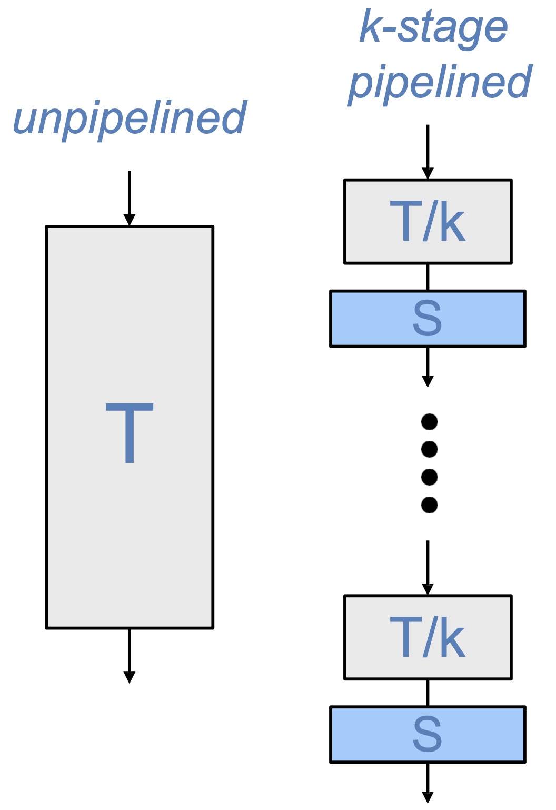
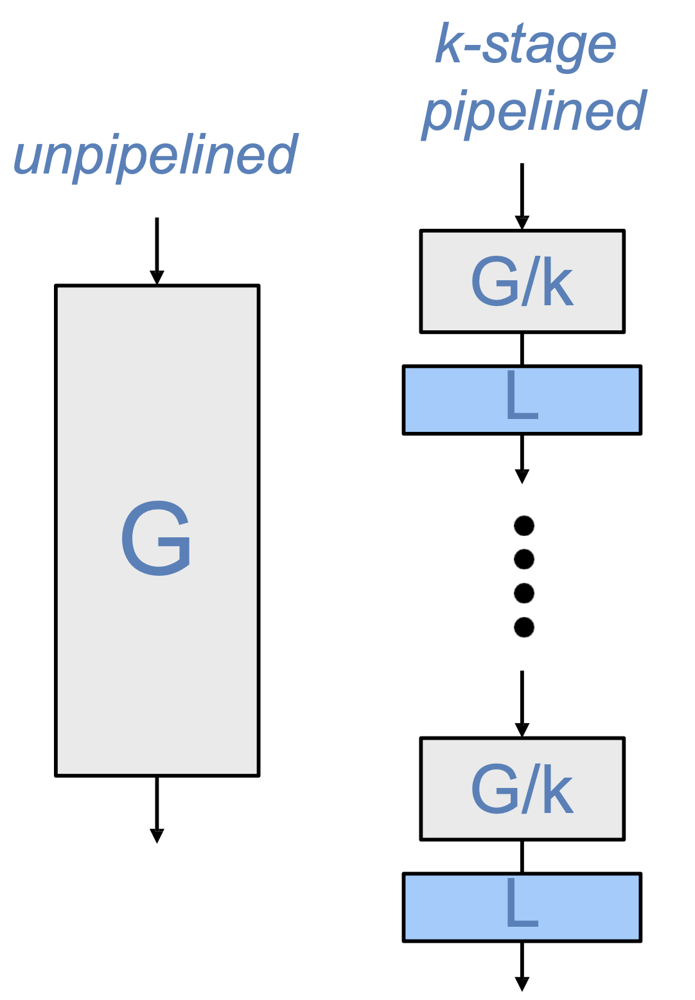
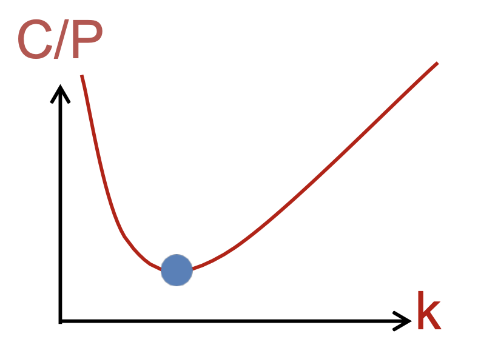

# 一、流水线

## 1.1 建模

### 性能模型

<figure>
  
  <figcaption>Pipeline Performance Model</figcaption>
</figure>

假设非流水线时延为 T，则非流水线吞吐率为：

$$
\textit{Throughput}_{unpipelined} = \frac{1}{T}
$$

假设流水线级数为 k，寄存器时延为 S，则流水线吞吐率为：

$$
\textit{Throughput}_{pipelined} = \frac{1}{\dfrac{T}{k} + S}
$$

### 成本模型

<figure>
  
  <figcaption>Pipeline Cost Model</figcaption>
</figure>

假设非流水线的设计成本为 G：

$$
\textit{Cost}_{unpipelined} = G
$$

假设流水线级数为 k，每一级流水线的成本为 L，则流水线的设计成本为：

$$
\textit{Cost}_{pipeline} = G + k \cdot L
$$

### 性能/成本权衡

<figure>
  
  <figcaption>Pipeline Cost Model</figcaption>
</figure>

$$
\frac{\textit{Cost}_{pipelined}}{\textit{Performance}_{pipelined}} = \frac{G + k \cdot L}{\dfrac{T}{k} + S} = (G + k \cdot L) \cdot (\frac{T}{k} + S)
$$

$$
k_{opt} = \sqrt{\frac{G \cdot T}{L \cdot S}}
$$