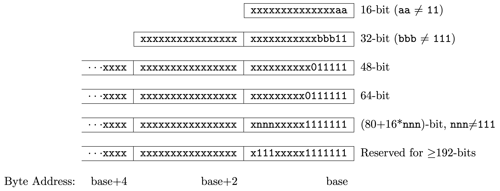
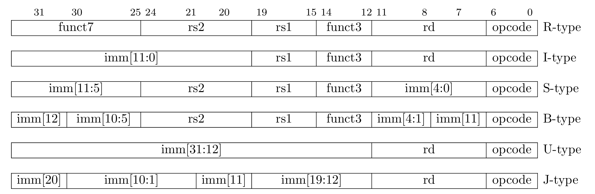
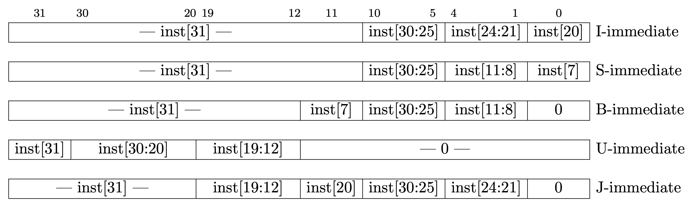

# 一、RISC-V 指令集概述

RISC-V指令集的一个特点是**模块化**，其核心是一个名为 RV32I 的基础 ISA，可运行完整的软件栈。
RV32I 已冻结，永不改变，这为编译器开发者、操作系统开发者和汇编语言程序员提供了稳定的指令目标。
模块化特性源于可选的标准扩展，硬件可根据应用程序的需求决定是否包含它们。
这种模块化特性能设计出面积小、能耗低的 RISC-V 处理器，这对于嵌入式应用至关重要。
RISC-V 编译器得知当前硬件包含哪些扩展后，便可为该硬件生成最优代码。

## 1.1 指令集分类

一般约定将扩展对应的字母加到指令集名称之后，以指示包含哪些扩展。
例如，RV32IMFDA 在必选基础指令集（RV32I）上添加了乘法（RV32M），单精度浮点（RV32F）, 双精度浮点（RV32D）和原子指令（RV32A）扩展。

!!! info "通用标量指令"

	RV32MFDA 以及 Zicsr，Zifencei 是 RISC-V 的标准扩展，它们与 RV32I 统称为 RV32G（G 代表 general），即 RV32G = RV32IMAFDZicsr_Zifencei。

	如果你注意过 ``RISC-V gcc`` 中的 ``-march`` 选项，你可能会发现它形如 ``rv32imac_zba_zbb_zbs_zbc_zicsr_zifencei``。
	这是因为，除了标准扩展之外，还有其他可选扩展，例如 ``zb*`` 指的是 “B” 标准扩展（Bit-manipulation）。

## 1.2 指令长度编码

RISC-V 支持变长指令，要求指令长度为 16 位的整数倍，与 16 位地址对齐。
对于 16 位的压缩指令集，其最低两位不能为 11；对于 32 位指令集，其最低两位固定为 11，第 [4:2] 位不能为 111。

硬件可以根据低位的若干位快速判断出指令的位宽，便于硬件电路的实现。

<figure>
  
  <figcaption>RISC-V Instruction Length Encoding</figcaption>
</figure>

!!! warning "指令长度"

    如无特殊说明，默认指令长度为 32-bit，即不考虑变长指令。

## 1.3 寄存器结构与特权模式定义

RISC-V 指令集架构支持 32 位、64 位和 128 位模式，相应的的寄存器位宽为 32-bit、64-bit和 128-bit（通常使用 **XLEN** 表示）。

RISC-V 指令集中有 32 个整数寄存器 x0-x31（General Purpose Register，GPR）。
如果需要实现浮点扩展，则需要另外一组独立的浮点寄存器 f0-f31。

??? info "寄存器别名"

	在程序员视角下，32个 GPR 有不同于 x0 ~ x31 的名称，这被称为 ABI （Application Binary Interface）。

	

	<table style="border-collapse: collapse;">
		<thead>
			<tr style="border: 2px solid black; background-color: #949494; color: white;">
				<th style="border: 1px solid black; padding: 8px; text-align: center; vertical-align: middle;">寄存器</th>
				<th style="border: 1px solid black; padding: 8px; text-align: center; vertical-align: middle;">ABI 名称</th>
				<th style="border: 1px solid black; padding: 8px; text-align: center; vertical-align: middle;">描述</th>
			</tr>
		</thead>
		<tbody>
			<tr style="border: 2px solid black; background-color: white; color: black;">
				<td style="border: 1px solid black; padding: 8px; text-align: center; vertical-align: middle;">x0</td>
				<td style="border: 1px solid black; padding: 8px; text-align: center; vertical-align: middle;">zero</td>
				<td style="border: 1px solid black; padding: 8px; text-align: center; vertical-align: middle;">硬件固定连接零</td>
			</tr>
			<tr style="border: 2px solid black; background-color: #eeeeee; color: black;">
				<td style="border: 1px solid black; padding: 8px; text-align: center; vertical-align: middle;">x1</td>
				<td style="border: 1px solid black; padding: 8px; text-align: center; vertical-align: middle;">ra</td>
				<td style="border: 1px solid black; padding: 8px; text-align: center; vertical-align: middle;">函数返回地址</td>
			</tr>
			<tr style="border: 2px solid black; background-color: white; color: black;">
				<td style="border: 1px solid black; padding: 8px; text-align: center; vertical-align: middle;">x2</td>
				<td style="border: 1px solid black; padding: 8px; text-align: center; vertical-align: middle;">sp</td>
				<td style="border: 1px solid black; padding: 8px; text-align: center; vertical-align: middle;">栈指针</td>
			</tr>
			<tr style="border: 2px solid black; background-color: #eeeeee; color: black;">
				<td style="border: 1px solid black; padding: 8px; text-align: center; vertical-align: middle;">x3</td>
				<td style="border: 1px solid black; padding: 8px; text-align: center; vertical-align: middle;">gp</td>
				<td style="border: 1px solid black; padding: 8px; text-align: center; vertical-align: middle;">全局指针</td>
			</tr>
			<tr style="border: 2px solid black; background-color: white; color: black;">
				<td style="border: 1px solid black; padding: 8px; text-align: center; vertical-align: middle;">x4</td>
				<td style="border: 1px solid black; padding: 8px; text-align: center; vertical-align: middle;">tp</td>
				<td style="border: 1px solid black; padding: 8px; text-align: center; vertical-align: middle;">线程指针</td>
			</tr>
			<tr style="border: 2px solid black; background-color: #eeeeee; color: black;">
				<td style="border: 1px solid black; padding: 8px; text-align: center; vertical-align: middle;">x5</td>
				<td style="border: 1px solid black; padding: 8px; text-align: center; vertical-align: middle;">t0</td>
				<td style="border: 1px solid black; padding: 8px; text-align: center; vertical-align: middle;">临时变量、备用链接寄存器</td>
			</tr>
			<tr style="border: 2px solid black; background-color: white; color: black;">
				<td style="border: 1px solid black; padding: 8px; text-align: center; vertical-align: middle;">x6-x7</td>
				<td style="border: 1px solid black; padding: 8px; text-align: center; vertical-align: middle;">t1-t2</td>
				<td style="border: 1px solid black; padding: 8px; text-align: center; vertical-align: middle;">临时变量</td>
			</tr>
			<tr style="border: 2px solid black; background-color: #eeeeee; color: black;">
				<td style="border: 1px solid black; padding: 8px; text-align: center; vertical-align: middle;">x8</td>
				<td style="border: 1px solid black; padding: 8px; text-align: center; vertical-align: middle;">s0/fp</td>
				<td style="border: 1px solid black; padding: 8px; text-align: center; vertical-align: middle;">保存用寄存器/帧指针（配合栈指针界定一个函数的栈）</td>
			</tr>
			<tr style="border: 2px solid black; background-color: white; color: black;">
				<td style="border: 1px solid black; padding: 8px; text-align: center; vertical-align: middle;">x9</td>
				<td style="border: 1px solid black; padding: 8px; text-align: center; vertical-align: middle;">s1</td>
				<td style="border: 1px solid black; padding: 8px; text-align: center; vertical-align: middle;">保存用寄存器</td>
			</tr>
			<tr style="border: 2px solid black; background-color: #eeeeee; color: black;">
				<td style="border: 1px solid black; padding: 8px; text-align: center; vertical-align: middle;">x10-x11</td>
				<td style="border: 1px solid black; padding: 8px; text-align: center; vertical-align: middle;">a0-a1</td>
				<td style="border: 1px solid black; padding: 8px; text-align: center; vertical-align: middle;">函数参数、返回值</td>
			</tr>
			<tr style="border: 2px solid black; background-color: white; color: black;">
				<td style="border: 1px solid black; padding: 8px; text-align: center; vertical-align: middle;">x12-x17</td>
				<td style="border: 1px solid black; padding: 8px; text-align: center; vertical-align: middle;">a2-a7</td>
				<td style="border: 1px solid black; padding: 8px; text-align: center; vertical-align: middle;">函数参数</td>
			</tr>
			<tr style="border: 2px solid black; background-color: #eeeeee; color: black;">
				<td style="border: 1px solid black; padding: 8px; text-align: center; vertical-align: middle;">x18-x27</td>
				<td style="border: 1px solid black; padding: 8px; text-align: center; vertical-align: middle;">s2-s11</td>
				<td style="border: 1px solid black; padding: 8px; text-align: center; vertical-align: middle;">保存用寄存器</td>
			</tr>
			<tr style="border: 2px solid black; background-color: white; color: black;">
				<td style="border: 1px solid black; padding: 8px; text-align: center; vertical-align: middle;">x28-x31</td>
				<td style="border: 1px solid black; padding: 8px; text-align: center; vertical-align: middle;">t3-t6</td>
				<td style="border: 1px solid black; padding: 8px; text-align: center; vertical-align: middle;">临时变量</td>
			</tr>
		</tbody>
	</table>

	

实际上还有另一个“寄存器堆”——**控制状态寄存器**（CSR），它们被用来实现特权架构所带来的新特性，例如 `mcause` 用于记录异常和中断的原因。
除了处理特权架构，还有一些 CSR 用于标识处理器特性或测量性能，例如 `mcycle` 用于记录运行周期数。
CSR 记录了 CPU 当前的状态信息，因此对于仿真或者流片后验证都十分重要。

RISC-V 指令集架构定义了三种工作模式，又称[特权模式](https://riscv.org/technical/specifications/)（Privilege Mode）。
特权级别用于为软件堆栈的不同组件之间提供保护，若执行当前特权模式不允许的操作，则会触发异常。
这些异常通常会导致陷阱（Trap），进入底层执行环境。

<table style="border-collapse: collapse;">
	<thead>
		<tr style="border: 2px solid black; background-color: #949494; color: white;">
			<th style="border: 1px solid black; padding: 8px; text-align: center; vertical-align: middle;">等级</th>
			<th style="border: 1px solid black; padding: 8px; text-align: center; vertical-align: middle;">编码</th>
			<th style="border: 1px solid black; padding: 8px; text-align: center; vertical-align: middle;">名称</th>
			<th style="border: 1px solid black; padding: 8px; text-align: center; vertical-align: middle;">简称</th>
		</tr>
	</thead>
	<tbody>
		<tr style="border: 2px solid black; background-color: white; color: black;">
			<td style="border: 1px solid black; padding: 8px; text-align: center; vertical-align: middle;">0</td>
			<td style="border: 1px solid black; padding: 8px; text-align: center; vertical-align: middle;">00</td>
			<td style="border: 1px solid black; padding: 8px; text-align: center; vertical-align: middle;">用户模式</td>
			<td style="border: 1px solid black; padding: 8px; text-align: center; vertical-align: middle;">U</td>
		</tr>
		<tr style="border: 2px solid black; background-color: #eeeeee; color: black;">
			<td style="border: 1px solid black; padding: 8px; text-align: center; vertical-align: middle;">1</td>
			<td style="border: 1px solid black; padding: 8px; text-align: center; vertical-align: middle;">01</td>
			<td style="border: 1px solid black; padding: 8px; text-align: center; vertical-align: middle;">监督模式</td>
			<td style="border: 1px solid black; padding: 8px; text-align: center; vertical-align: middle;">S</td>
		</tr>
		<tr style="border: 2px solid black; background-color: white; color: black;">
			<td style="border: 1px solid black; padding: 8px; text-align: center; vertical-align: middle;">2</td>
			<td style="border: 1px solid black; padding: 8px; text-align: center; vertical-align: middle;">10</td>
			<td style="border: 1px solid black; padding: 8px; text-align: center; vertical-align: middle;">保留</td>
			<td style="border: 1px solid black; padding: 8px; text-align: center; vertical-align: middle;">\</td>
		</tr>
		<tr style="border: 2px solid black; background-color: #eeeeee; color: black;">
			<td style="border: 1px solid black; padding: 8px; text-align: center; vertical-align: middle;">3</td>
			<td style="border: 1px solid black; padding: 8px; text-align: center; vertical-align: middle;">11</td>
			<td style="border: 1px solid black; padding: 8px; text-align: center; vertical-align: middle;">机器模式</td>
			<td style="border: 1px solid black; padding: 8px; text-align: center; vertical-align: middle;">M</td>
	</tbody>
</table>

其中机器模式为必选的模式，其他两种为可选模式，通过不同的模式组合可以实现不同的系统。

- 仅有机器模式的，通常为**嵌入式系统**。
- 支持机器模式与用户模式的系统，可以实现**资源保护**。
- 支持机器模式、监督模式与用户模式的系统，可以实现**类似 UNIX 的操作系统**。

应用程序（在 U-mode 下运行）通常无法直接执行特权指令，而是通过**系统调用**（Syscall）机制请求操作系统（在 S-mode 或 M-mode 下运行）提供服务，如访问硬件或管理资源。

## 1.4 指令编码

在 RISC-V 指令集架构中，有 4 种指令格式（R/I/S/U），指令长度固定为 32-bit（不考虑指令长度扩展），必须与 4-byte 地址对齐（通常使用 **IALIGN** 表示）。

??? tip "instruction-address-migaligned exception"

    分支指令或无条件跳转指令可能会导致 `instruction-address-misaligned` 异常，触发该异常的指令（即所记录的异常指令）为分支或跳转指令，不是目标指令。

??? info "reserved instruction"

    RISC-V ISA 通常会保留一些位置的编码，以便未来扩展，这些位置的指令称为 `reserved instruction`。
    解码器在遇到 `reserved instruction` 时的行为 ISA 并为定义，取决于具体硬件。

在实现中，解码器通常位于**关键路径**上，因此将所有格式中的 Opcode、rs1（register specifiers）等保持在同一位置，代价是立即数被拆分成多个部分。

为了获得足够的编码空间，立即数编码只有 12-bit，对于 32-bit 立即数，需要使用两条指令（其中一条为 LUI，load-upper-immediate）来加载。

U/J 型指令有 20-bit 立即数位，用于更加高效地**处理立即数**。

<figure>
  
  <figcaption>RISC-V Instruction Format</figcaption>
</figure>

S 格式和 B 格式之间的唯一区别是，在 B 格式中，12 位立即数**需要乘 2** 作为偏移量。
B 格式中间位（imm[10:1]）和符号位（imm[12]）**保持在固定位置**（与 S 相同），而 S 格式中的最低位（inst[7]）在 B 格式中**编码为高位**（imm[11]）。

U 格式和 J 格式之间的唯一区别是 20 位立即数**左移 12 位**形成 U 型指令立即数，**左移 1 位**形成 J 型指令立即数。
U 和 J 格式立即数中指令位的位置选择是为了最大限度地与其他格式及彼此**重叠**。

下图为不同指令格式所产生的 32-bit 立即数。

<figure>
  
  <figcaption>Types of Immediate</figcaption>
</figure>

**符号扩展**是立即数运算上最重要的操作之一（特别是对于 XLEN > 32 的架构来说）。
在RISC-V中，所有立即数的符号位**始终在指令的最高位**中，允许符号扩展与指令解码**并行**进行。

指令编码中的立即数通常需要进行某些位操作，比如左移一位来实现乘以 2 的效果。
传统方法是使用**硬件多路复用器**来动态地进行这些操作，这会增加硬件的复杂性和成本。
通过在编码阶段直接**对立即数的位进行调整**（相当于**在编码时就已经完成了位操作**），可以减少这些硬件多路复用器的使用，从而**降低信号扇出和硬件成本**。